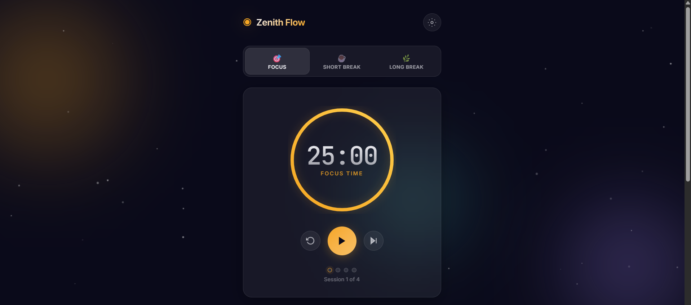
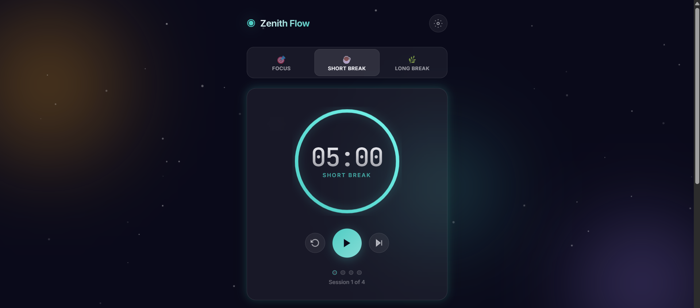
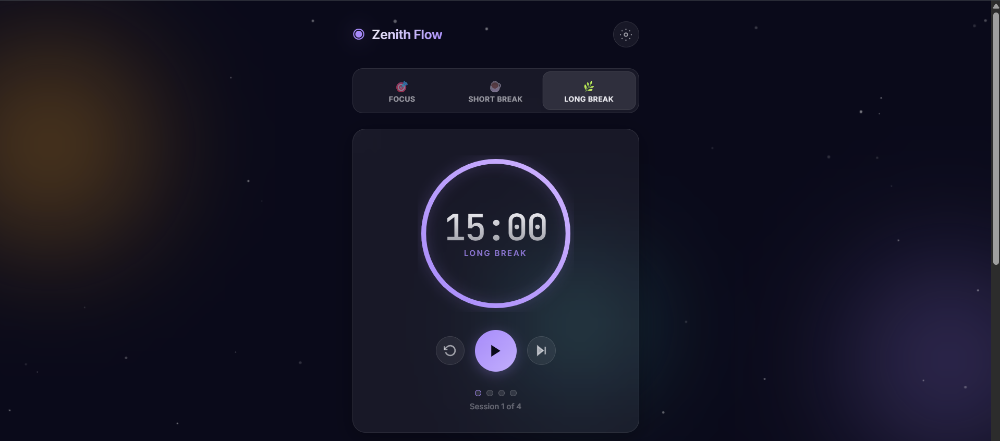
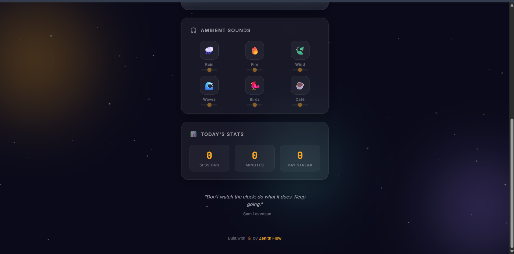
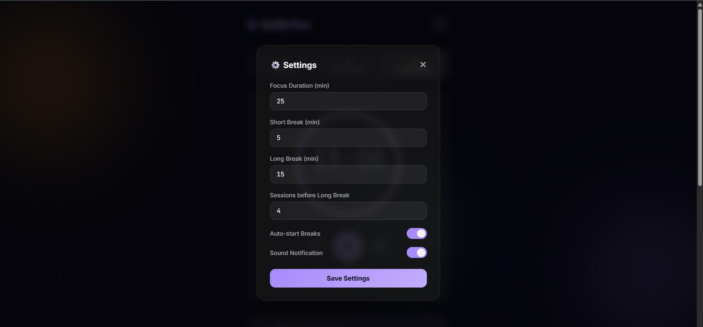

# ◉ Zenith Flow

> A stunning, ambient productivity timer with procedural soundscapes — built with vanilla HTML, CSS & JavaScript.


## ✨ Features

- **🎯 Pomodoro Timer** — Customizable Focus / Short Break / Long Break modes with a beautiful circular progress ring.
- **🎧 6 Ambient Soundscapes** — Rain, Fire, Wind, Waves, Birds & Café — all generated live using the **Web Audio API** (no external audio files!).
- **🎨 Glassmorphism UI** — Premium dark-mode design with frosted-glass cards, animated gradient orbs, and floating particles.
- **🎨 Dynamic Themes** — Accent colors shift automatically based on the current mode (amber for focus, teal for breaks, lavender for long breaks).
- **📊 Daily Stats** — Track your focus sessions, total minutes, and daily streak.
- **⚙️ Customizable Settings** — Adjust durations, toggle auto-start breaks, and control sound notifications.
- **💾 Local Persistence** — All settings and stats saved to `localStorage` — no accounts needed.
- **⌨️ Keyboard Shortcut** — Press `Space` to start/pause the timer instantly.
- **💡 Motivational Quotes** — Rotating inspirational quotes to keep you motivated.

## 🚀 Getting Started

No build step. No dependencies. Just open the file:

```bash
# Clone this repository
git clone https://github.com/YOUR_USERNAME/Zenith-Flow.git

# Open in your browser
open index.html
# or on Windows:
start index.html
```

## 🛠️ Tech Stack

| Technology | Purpose |
|---|---|
| **HTML5** | Semantic structure |
| **CSS3** | Glassmorphism, animations, responsive design |
| **Vanilla JS** | Timer logic, state management |
| **Web Audio API** | Procedural ambient sound generation |
| **Canvas API** | Floating particle effects |
| **localStorage** | Settings & stats persistence |

## 🎧 How the Sounds Work

Instead of loading audio files, Zenith Flow **generates all ambient sounds programmatically** using the Web Audio API:

| Sound | Technique |
|---|---|
| 🌧️ Rain | White noise → Low-pass filter (1200 Hz) |
| 🔥 Fire | Brown noise + random crackle spikes |
| 🍃 Wind | White noise → Band-pass filter + LFO modulation |
| 🌊 Waves | White noise → Low-pass filter + slow sine LFO |
| 🐦 Birds | Randomized sine oscillator chirps |
| ☕ Café | White noise → Band-pass + low-pass chain |

## 📁 Project Structure

```
Zenith-Flow/
├── index.html    # Main HTML — semantic structure
├── style.css     # All styling — glassmorphism, animations
├── app.js        # App logic — timer, sounds, persistence
└── README.md     # This file
```

## 📸 Preview

````carousel

<!-- slide -->

<!-- slide -->

<!-- slide -->

<!-- slide -->

````

Open `index.html` in any modern browser to see the full experience.

<p align="center">Built with 🔥 focus and ☕ caffeine</p>
